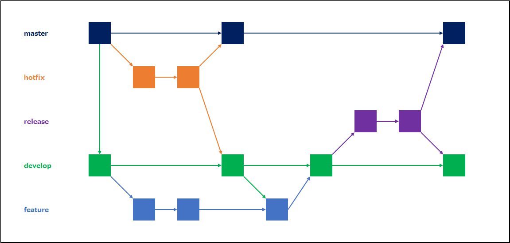

# Wiki of GitLab

<a id = "contents">

# Contents
* [利用する5種類のブランチ](#利用する5種類のブランチ)

### Pickup
* [git-flow 図解](https://qiita.com/ohnaka0410/items/7c7fa20710dfd72b7d7a)

<a id = "利用する5種類のブランチ">

## 利用する5種類のブランチ
* 

* commands

### [Return to Contents](#contents)